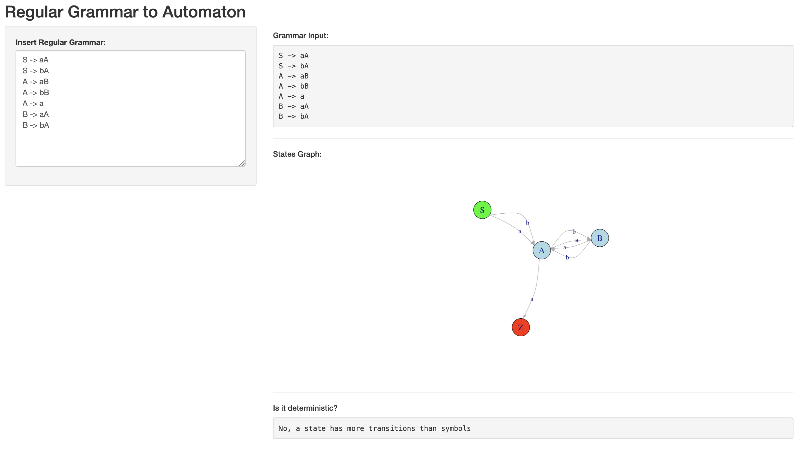

# Regular Grammar to Automaton

This project is a Shiny web application that allows users to convert a regular grammar into its equivalent finite automaton (FA). The application visualizes the automaton as a directed graph and checks whether the resulting automaton is deterministic (DFA).

## Features

- **Grammar Input:** Enter a regular grammar using a simple text format.
- **Automaton Visualization:** View the corresponding finite automaton as a graph.
- **Determinism Check:** Instantly see if the automaton is deterministic (DFA).
- **Interactive UI:** Built with [Shiny](https://shiny.rstudio.com/) for an intuitive user experience.

## Getting Started

### Prerequisites

- [R](https://www.r-project.org/) (version 4.0 or higher recommended)
- [Shiny](https://cran.r-project.org/package=shiny)
- [igraph](https://cran.r-project.org/package=igraph)

You can install the required R packages with:

```r
install.packages("shiny")
install.packages("igraph")
```

### Running the Application

1. Clone or download this repository.
2. Open `main.R` in RStudio or your preferred R environment.
3. Run the app in terminal with:

```r
R -e "shiny::runApp('main.R')"
```

Alternatively, you can simply click the "Run App" button in RStudio.

## Usage

1. **Input your grammar:**  
   Enter your regular grammar in the text area. Each rule should be on a separate line, using the format `NonTerminal -> string`, e.g.:

   ```
   S -> aA
   S -> bA
   A -> aB
   A -> bB
   A -> a
   B -> aA
   B -> bA
   ```

2. **View the automaton:**  
   The graph will update automatically to reflect the grammar.

3. **Check determinism:**  
   The app will indicate whether the automaton is deterministic.

## Grammar Format

- Each production rule must be on a separate line.
- Use `->` to separate the left-hand side (non-terminal) from the right-hand side.
- Non-terminals should be uppercase letters (e.g., `S`, `A`, `B`).
- Terminals should be lowercase letters (e.g., `a`, `b`).
- Epsilon (empty string) transitions are not supported.

## Project Structure

- `main.R`: Main application file containing the UI and server logic.

## Example

**Input:**
```
S -> aA
S -> bA
A -> aB
A -> bB
A -> a
B -> aA
B -> bA
```

**Output:**
- A directed graph representing the automaton.
- A message indicating if the automaton is deterministic.

